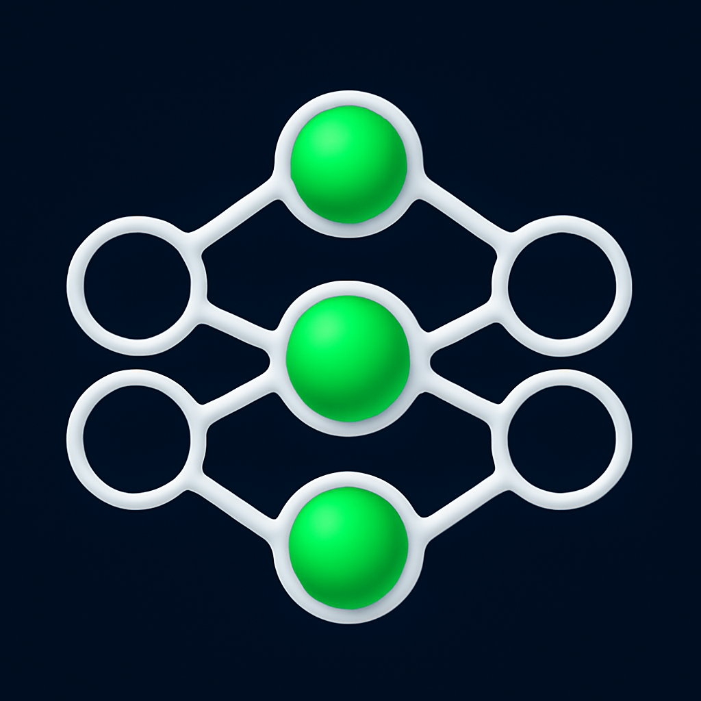

# VisionSense

<p align="center">
  
</p>

<p align="center">
  <b>Advanced Autonomous Vehicle Perception System</b><br>
  Real-time perception powered by TensorRT on NVIDIA Jetson
</p>

<p align="center">
  <a href="#features">Features</a> •
  <a href="#system-architecture">Architecture</a> •
  <a href="#installation">Installation</a> •
  <a href="#usage">Usage</a> •
  <a href="#nodes">Nodes</a>
</p>

---

https://github.com/user-attachments/assets/8b5bfc2b-9bf6-4562-895b-04ba0c5b41e3

## Overview

VisionSense is a comprehensive ROS2-based computer vision system designed for autonomous vehicles running on NVIDIA Jetson platforms with JetPack 6.2. It provides a complete perception pipeline with real-time object detection, lane detection, traffic sign recognition, stereo depth estimation, and driver monitoring capabilities.

## Features

| Feature | Description | Model/Method |
|---------|-------------|--------------|
| **Object Detection** | Detect vehicles, pedestrians, cyclists, traffic signs/lights | YOLOv8 + TensorRT |
| **Multi-Object Tracking** | Track objects across frames with unique IDs | BYTE Tracker + Kalman Filter |
| **Lane Detection** | Segment and detect lane lines | Neural Network + TensorRT |
| **Traffic Sign Recognition** | Classify 50+ traffic sign types | YOLOv8 Classifier + TensorRT |
| **Stereo Depth Estimation** | Dense depth maps from stereo camera | LightStereo + TensorRT |
| **Driver Monitoring** | Face detection and gaze estimation | YOLOv11 + ResNet18 + TensorRT |
| **Data Fusion GUI** | Real-time visualization of all perception data | OpenCV + X11 |
| **Web Dashboard** | Remote monitoring interface | HTTP Server |

## System Architecture

```
┌─────────────────────────────────────────────────────────────────────────────┐
│                            VisionSense Architecture                          │
├─────────────────────────────────────────────────────────────────────────────┤
│                                                                              │
│   ┌──────────────┐     ┌──────────────┐     ┌──────────────┐                │
│   │ Mono Camera  │     │Stereo Camera │     │   IMU/GPS    │                │
│   │  (CSI/USB)   │     │  (Arducam)   │     │   Module     │                │
│   └──────┬───────┘     └──────┬───────┘     └──────┬───────┘                │
│          │                    │                    │                         │
│          ▼                    ▼                    ▼                         │
│   ┌──────────────┐     ┌──────────────┐     ┌──────────────┐                │
│   │    camera    │     │ camera_stereo│     │   imu_gps    │                │
│   │     node     │     │     node     │     │     node     │                │
│   └──────┬───────┘     └──────┬───────┘     └──────┬───────┘                │
│          │                    │                    │                         │
│          ▼                    ├────────┬───────────┘                         │
│   ┌──────────────┐            │        │                                     │
│   │   driver     │            ▼        ▼                                     │
│   │   monitor    │     ┌─────────┐ ┌─────────┐                               │
│   └──────┬───────┘     │ detect  │ │ stereo  │                               │
│          │             │  node   │ │  depth  │                               │
│          │             └────┬────┘ └────┬────┘                               │
│          │                  │           │                                    │
│          │             ┌────┴────┐      │                                    │
│          │             ▼         ▼      │                                    │
│          │      ┌─────────┐ ┌─────────┐ │                                    │
│          │      │classify │ │ lanedet │ │                                    │
│          │      │  node   │ │  node   │ │                                    │
│          │      └────┬────┘ └────┬────┘ │                                    │
│          │           │           │      │                                    │
│          │           └─────┬─────┘      │                                    │
│          │                 │            │                                    │
│          │                 ▼            │                                    │
│          │          ┌──────────┐        │                                    │
│          │          │   adas   │        │                                    │
│          │          │   node   │        │                                    │
│          │          └────┬─────┘        │                                    │
│          │               │              │                                    │
│          └───────────────┼──────────────┘                                    │
│                          ▼                                                   │
│                   ┌──────────────┐     ┌──────────────┐                      │
│                   │     GUI      │     │  Dashboard   │                      │
│                   │  (Display)   │     │    (Web)     │                      │
│                   └──────────────┘     └──────────────┘                      │
│                                                                              │
└─────────────────────────────────────────────────────────────────────────────┘
```

## System Requirements

| Component | Requirement |
|-----------|-------------|
| **Hardware** | NVIDIA Jetson Orin Nano/NX/AGX |
| **OS** | Ubuntu 22.04 (JetPack 6.2) |
| **ROS2** | Humble Hawksbill |
| **CUDA** | 12.6+ |
| **TensorRT** | 10.x |
| **OpenCV** | 4.x with CUDA support |

---

## Nodes

### 1. Camera Node (`camera`)

Captures video from mono cameras (CSI or USB) for driver monitoring.

| Parameter | Type | Default | Description |
|-----------|------|---------|-------------|
| `resource` | string | `csi://0` | Camera source URI |
| `width` | int | 1280 | Frame width |
| `height` | int | 720 | Frame height |

**Topics Published:**
- `/camera/raw` (`sensor_msgs/Image`) - Raw camera frames

**Supported Sources:**
- CSI Camera: `csi://0`
- USB Camera: `v4l2:///dev/video0`
- Video File: `file:///path/to/video.mp4`

---

### 2. Stereo Camera Node (`camera_stereo`)

Handles Arducam stereo camera with synchronized left/right image capture and CUDA-accelerated rotation.

| Parameter | Type | Default | Description |
|-----------|------|---------|-------------|
| `resource` | string | `/dev/video1` | V4L2 device path |
| `width` | int | 3840 | Full stereo width (1920×2) |
| `height` | int | 1200 | Stereo height |
| `framerate` | int | 30 | Capture framerate |
| `rotated_lenses` | bool | false | Apply 90° rotation to each eye |
| `cuda_flip` | string | `rotate-180` | CUDA flip mode: `rotate-180`, `vertical-flip`, `horizontal-flip`, or empty for none |

**Topics Published:**
- `/camera_stereo/left/image_raw` (`sensor_msgs/Image`) - Left camera (1200×1200)
- `/camera_stereo/right/image_raw` (`sensor_msgs/Image`) - Right camera (1200×1200)

**CUDA Kernels:**
- Left eye: 90° counter-clockwise rotation
- Right eye: 90° clockwise rotation

---

### 3. Stereo Depth Node (`stereo_depth`)

Computes dense depth maps using LightStereo neural network with TensorRT acceleration.

| Parameter | Type | Default | Description |
|-----------|------|---------|-------------|
| `model` | string | `LightStereo-S-KITTI.engine` | TensorRT engine path |
| `max_disparity` | float | 192.0 | Maximum disparity value |
| `warmup_iterations` | int | 5 | Model warmup runs |

**Topics Subscribed:**
- `left/image_raw` (`sensor_msgs/Image`) - Left stereo image
- `right/image_raw` (`sensor_msgs/Image`) - Right stereo image

**Topics Published:**
- `/stereo_depth/disparity` (`sensor_msgs/Image`) - Normalized disparity (mono8, 0-255)

**Model Specifications:**
- Input: Stereo pair (preprocessed with aspect-preserving resize and RightTopPad)
- Output: Dense disparity map (resized back to input dimensions)
- Architecture: LightStereo-S (KITTI trained)

---

### 4. Object Detection Node (`detect`)

Real-time object detection using YOLOv8 with TensorRT and multi-object tracking.

| Parameter | Type | Default | Description |
|-----------|------|---------|-------------|
| `model` | string | `detect.engine` | TensorRT engine path |
| `labels` | string | `labels_detect.txt` | Class labels file |
| `thresholds` | float[] | [0.40, 0.45, ...] | Per-class confidence thresholds |
| `track_frame_rate` | int | 30 | Tracking frame rate |
| `track_buffer` | int | 30 | Lost track buffer size |

**Detected Classes:**
| ID | Class | Threshold |
|----|-------|-----------|
| 0 | Pedestrian | 0.45 |
| 1 | Cyclist | 0.45 |
| 2 | Vehicle-Car | 0.60 |
| 3 | Vehicle-Bus | 0.45 |
| 4 | Vehicle-Truck | 0.45 |
| 5 | Train | 0.50 |
| 6 | Traffic Light | 0.40 |
| 7 | Traffic Sign | 0.55 |

**Topics Subscribed:**
- `/detect/image_in` (`sensor_msgs/Image`) - Input image

**Topics Published:**
- `/detect/detections` (`visionconnect/Detect`) - Detection results with tracking
- `/detect/signs` (`visionconnect/Signs`) - Cropped traffic signs for classification

**Tracking Features:**
- BYTE tracker with Kalman filter prediction
- Unique ID assignment per tracked object
- ID format: `{ClassName}_{ID}` (e.g., `Car_001`, `Pedestrian_003`)

---

### 5. Traffic Sign Classification Node (`classify`)

Classifies detected traffic signs and lights into 50+ categories.

| Parameter | Type | Default | Description |
|-----------|------|---------|-------------|
| `model` | string | `classify.engine` | TensorRT engine path |
| `labels` | string | `labels_classify.txt` | Class labels file |
| `thresholds` | float[] | [0.30, 0.75] | Traffic light/sign thresholds |

**Supported Sign Categories:**
- **Traffic Lights:** Red, Yellow, Green
- **Regulatory Signs:** Stop, Yield, Speed Limits (15-70 mph), No Entry, No U-Turn, etc.
- **Warning Signs:** Curve Ahead, Intersection, School Zone, Road Work, etc.
- **Guide Signs:** Lane Markers, Merge, Highway Signs

**Topics Subscribed:**
- `/classify/signs_in` (`visionconnect/Signs`) - Cropped sign images

**Topics Published:**
- `/classify/signs` (`visionconnect/Signs`) - Classified signs with labels

---

### 6. Lane Detection Node (`lanedet`)

Detects and segments lane lines using neural network inference.

| Parameter | Type | Default | Description |
|-----------|------|---------|-------------|
| `model` | string | `lane_detect.engine` | TensorRT engine path |

**Topics Subscribed:**
- `/lanedet/image_in` (`sensor_msgs/Image`) - Input image

**Topics Published:**
- `/lanedet/lanes` (`visionconnect/Lanes`) - Detected lane data
  - `xs`, `ys`: Lane point coordinates
  - `probs`: Lane confidence (4 lanes max)
  - `num_lanes`: Number of detected lanes
  - `laneimg`: Visualization overlay

**Output:**
- Up to 4 lane lines detected
- Polyline representation with confidence scores
- Segmentation mask overlay

---

### 7. Driver Monitoring Node (`driver_monitor`)

TensorRT-accelerated driver attention monitoring using face detection and gaze estimation.

| Parameter | Type | Default | Description |
|-----------|------|---------|-------------|
| `face_engine` | string | `yolov11n_face_fp16.engine` | Face detection model |
| `gaze_engine` | string | `resnet18_gaze_fp16.engine` | Gaze estimation model |
| `camera_topic` | string | `/camera/raw` | Input camera topic |
| `confidence` | float | 0.5 | Face detection threshold |

**Driver States:**
| State | Condition | Alert |
|-------|-----------|-------|
| `ALERT` | Face detected, gaze forward | No |
| `DISTRACTED` | Gaze >30° off-center for 2s | Yes |
| `DROWSY` | Eyes closed (future) | Yes |
| `NO_DRIVER` | No face detected for 1s | Yes |

**Topics Subscribed:**
- `/camera/raw` (`sensor_msgs/Image`) - Driver-facing camera

**Topics Published:**
- `/driver_monitor/image` (`sensor_msgs/Image`) - Annotated output with gaze arrow
- `/driver_monitor/state` (`std_msgs/String`) - Current driver state
- `/driver_monitor/alert` (`std_msgs/Bool`) - Alert flag

**Models:**
- **Face Detection:** YOLOv11-nano (640×640 input, 8400 detections)
- **Gaze Estimation:** ResNet18 (448×448 input, pitch/yaw angles)

---

### 8. ADAS Node (`adas`)

Advanced Driver Assistance System alerts based on lane and detection data.

**Topics Subscribed:**
- `/adas/lanes_in` (`visionconnect/Lanes`) - Lane detection data

**Topics Published:**
- `/adas/adas_alerts` (`visionconnect/ADAS`) - ADAS warnings

**Alerts:**
- Lane departure warning
- Forward collision warning (with depth data)

---

### 9. IMU/GPS Node (`imu_gps`)

Sensor fusion for IMU and GPS data (BNO055 + GPS module).

**Topics Published:**
- `/imu_gps/imu/data` (`sensor_msgs/Imu`) - IMU orientation and acceleration
- `/imu_gps/gps/fix` (`sensor_msgs/NavSatFix`) - GPS coordinates

---

### 10. GUI Node (`gui`)

Real-time data fusion display with multi-panel layout.

**Layout:**
```
┌────────────────────────────┬─────────────────┐
│                            │ Driver Monitor  │
│                            │   (1/3 × 1/3)   │
│       Main View            ├─────────────────┤
│    (2/3 × Full Height)     │  Stereo Depth   │
│                            │   (1/3 × 1/3)   │
│    Object Detection +      ├─────────────────┤
│    Lane Overlay +          │    Summary      │
│    Traffic Signs           │   (1/3 × 1/3)   │
│                            │  Speed/GPS/IMU  │
└────────────────────────────┴─────────────────┘
```

**Topics Subscribed:**
- `/gui/image_in` - Main camera feed
- `/gui/detect_in` - Detection results
- `/gui/signs_in` - Classified signs
- `/gui/lanes_in` - Lane detection
- `/gui/adas_in` - ADAS alerts
- `/driver_monitor/image` - Driver monitor feed
- `/stereo_depth/disparity` - Depth visualization
- `/imu_gps/imu/data` - IMU data
- `/imu_gps/gps/fix` - GPS coordinates

---

### 11. Dashboard Node (`dashboard`)

Web-based monitoring interface accessible via browser.

**Access:** `http://<jetson-ip>:8080`

**Features:**
- Live video stream
- Detection statistics
- System status

---

## Installation

### Step 1: Clone the Repository

```bash
git clone https://github.com/connected-wise/VisionSense.git
cd VisionSense
```

### Step 2: Install OpenCV with CUDA Support

Build OpenCV from source with CUDA acceleration (required for Jetson):

```bash
sudo bash install_opencv_cuda_orin.sh
```

> **Note:** This process takes 2-3 hours. The script will:
> - Install all OpenCV build dependencies
> - Download and compile the latest OpenCV with CUDA 12.6 support
> - Configure for Jetson Orin (compute capability 8.7)

### Step 3: Install ROS2 and Project Dependencies

Install ROS2 Humble, jetson-inference, and all required libraries:

```bash
sudo bash install_all_deps.sh
```

This script installs:
- ROS2 Humble desktop and vision packages
- Build tools (cmake, colcon, etc.)
- jetson-inference library
- Python dependencies (numpy, pyserial)
- System libraries (Eigen3, Qt5, V4L utilities)

### Step 4: Build VisionSense

```bash
source /opt/ros/humble/setup.bash
colcon build --packages-select visionconnect
```

## Usage

### Desktop Launcher
Double-click the **VisionSense** icon on the desktop.

### Command Line
```bash
source /opt/ros/humble/setup.bash
cd ~/VisionSense && source install/setup.bash
ros2 launch visionconnect visionsense.launch.py
```

### Individual Nodes
```bash
ros2 run visionconnect camera
ros2 run visionconnect detect
ros2 run visionconnect gui
```

## Configuration

Edit `config/config.yaml`:

```yaml
sensors:
    uv_camera:     true    # Mono camera for driver monitoring
    zed_camera:    true    # Stereo camera
    gps_module:    true    # GPS/IMU module

camera:
    ros__parameters:
        resource:   "csi://0"
        width:      1280
        height:     720

camera_stereo:
    ros__parameters:
        resource:       "/dev/video1"
        width:          3840
        height:         1200
        rotated_lenses: true

detect:
    ros__parameters:
        model:      "detect.engine"
        thresholds: [0.40, 0.45, 0.45, 0.6, 0.45, 0.45, 0.5, 0.40, 0.55]

driver_monitor:
    ros__parameters:
        face_engine: "/path/to/yolov11n_face_fp16.engine"
        gaze_engine: "/path/to/resnet18_gaze_fp16.engine"
        confidence:  0.5
```

## Neural Network Models

| Model | Purpose | Input Size | Format |
|-------|---------|------------|--------|
| `detect.engine` | Object Detection | 640×640 | TensorRT FP16 |
| `classify.engine` | Sign Classification | 224×224 | TensorRT FP16 |
| `lane_detect.engine` | Lane Detection | 800×288 | TensorRT FP16 |
| `LightStereo-S-KITTI.engine` | Stereo Depth | 1200×1200 | TensorRT FP16 |
| `yolov11n_face_fp16.engine` | Face Detection | 640×640 | TensorRT FP16 |
| `resnet18_gaze_fp16.engine` | Gaze Estimation | 448×448 | TensorRT FP16 |

## ROS2 Topics Overview

```
/camera/raw                    - Mono camera output
/camera_stereo/left/image_raw  - Left stereo image
/camera_stereo/right/image_raw - Right stereo image
/stereo_depth/disparity        - Depth visualization
/detect/detections             - Object detections with tracking
/detect/signs                  - Detected traffic signs
/classify/signs                - Classified traffic signs
/lanedet/lanes                 - Lane detection results
/driver_monitor/image          - Driver monitoring visualization
/driver_monitor/state          - Driver state (ALERT/DISTRACTED/etc)
/adas/adas_alerts              - ADAS warnings
/imu_gps/imu/data              - IMU sensor data
/imu_gps/gps/fix               - GPS coordinates
/gui/fusion                    - Fused visualization output
```

## Troubleshooting

### Camera Issues
```bash
# List available cameras
v4l2-ctl --list-devices

# Test stereo camera
gst-launch-1.0 v4l2src device=/dev/video1 ! videoconvert ! autovideosink
```

### Build Errors
```bash
# Clean rebuild
rm -rf build install log
colcon build --packages-select visionconnect
```

### TensorRT Issues
Ensure models are built for your specific Jetson platform (engine files are not portable).

## License

VisionSense is licensed for **non-commercial research and educational use only**.

✅ **Allowed:** Research, education, testing, developing your own technologies
❌ **Not Allowed:** Commercial use, integration into products, offering as a service
💼 **Commercial License:** Contact licensing@connectedwise.com

See [LICENSE](LICENSE) for full terms.

## Contributing

1. Fork the repository
2. Create a feature branch (`git checkout -b feature/my-feature`)
3. Commit changes (`git commit -m 'feat: add feature'`)
4. Push to branch (`git push origin feature/my-feature`)
5. Open a Pull Request

---

<p align="center">
  <b>VisionSense</b> - Autonomous Vehicle Vision System<br>
  © 2025 ConnectedWise
</p>
